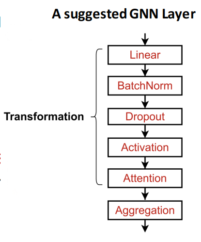

# Task08 图神经网络基础

## 1 知识回顾

- 节点嵌入表示：相似度的计算$\text{similarity}(u, v) = z_v^T z_u$
- 深度图编码器：基于图结构的多层非线性变换
- 使用场景包括节点分类、连接预测、社区检测、网络相似性
- 主要解决的难点：
	- 任意尺寸输入、拓扑复杂
	- 没有固定节点顺序和参考锚点
	- 动态变化，具有多模态特征

## 2 深度学习基础

- 监督学习：给定输入$x$，预测标签$y$，目标函数是$\min \limits_{\Theta} \mathcal{L}(y, f(x))$
- 损失函数（交叉熵损失函数）：$\displaystyle \text{CrossEntropy}(y, f(x)) = -\sum_{i= 1}^C (y_i \log f(x)_i)$，其中$y_i$和$f(x)_i$是第$i$类的实际值和预测值
- 优化目标函数：
    - 梯度下降法：沿着梯度的相反方向不断更新权重，直至收敛
    - 随机梯度下降法：在每一步中选择不同的小批量数据集作为输入，使用梯度下降不断迭代，更新权重
- 反向传播：基于链式法则，计算复合函数的导数，将误差从输出层向隐藏层反向传播，直至传播到输入层

- 非线性激活函数：
    - $\text{ReLU}(x) = \max(x, 0)$
    - $\displaystyle \sigma (x) = \frac{1}{1 + e^{-x}}$

## 3 图深度学习

- 神经网络的图表示：把图表示成邻接矩阵，再把邻接矩阵嵌入节点特征，最后把该矩阵作为神经网络的输入
- 解决方案：将卷积推广到图的网络中，同时利用节点特征，通过传递和聚集邻居节点的信息，可设计不同的图神经网络

## 4 图卷积网络（GCN）

### 4.1 图卷积网络基本思想

- 基本思想：基于本地网络的领域生成节点嵌入表示，对每个节点分别构建自己的计算图
- 与经典神经网络的不同之处：图神经网络每个节点基于其邻域定义一个计算图，如果两个节点的网络邻域相似，那么这两个节点将具有相同的计算图
- 节点聚合：将领域的所有信息求平均值

### 4.2 深度编码器

- 深度编码器：
$$
\begin{array}{l}
h_v^{(0)} = x_v \\
h_v^{k+1} = \sigma(W_k \sum_{u \in N(v)} \frac{h_u^{(k)}}{|N(v)|} + B_k h_v^{(k)}), \forall k \in \{0, 1, \cdots, K-1\}\\
z_v = h_v^{(K)}
\end{array}
$$
其中，$\sigma$是非线性激活函数，例如ReLU；$W_k$表示领域聚合的权重；$B_k$表示隐藏层的权重；$N(v)$是节点$v$的邻域（相连节点）

记：$H^{(k)} = [h_1^{(k)} \cdots h_{|V|}^{(k)}]^T$，$D_{v,v} = Deg(v) = |N(v)|$，可得：
$$
\sum_{u \in N(v)} \frac{h_u^{(k - 1)}}{|N(v)|} \Rightarrow H^{(k + 1)} = D^{-1} A H^{(k)}
$$

更新函数可得：
$$
H^{(k + 1)} = \sigma (\tilde{A} H^{(k)} W_k^T + H^{(k)} B_k^T)
$$
其中，$\tilde{A} = D^{-1} A$

### 4.3 模型训练

- 监督学习：最小化损失函数
- 无监督学习：可以用图结构作为自监督

- 无监督训练：激活函数为$\displaystyle \mathcal{L} = \sum_{z_u, z_v} \text{CE} (y_{u,v}, \text{DEC}(z_u, z_v))$

- 自监督训练：激活函数为$\displaystyle \mathcal{L} = \sum_{v \in V} y_v \log(\sigma (z_v^T \theta)) + (1 - y_v) \log (1 - \sigma(z_v^T \theta))$

### 4.4 图神经网络现代设计

- 模型构建步骤：
    1. 定义聚合邻域的信息方式
    2. 定义损失函数
    3. 基于计算图的MiniBatch训练节点
    4. 生成需要的节点嵌入，然后泛化到新节点

- 所有的节点共享相同的聚合参数$W_k$和$B_k$

## 5 GNNs、CNNs和Transformers对比

- CNNs：更新公式是
$$
h_v^{l + 1} = \sigma \left( \sum_{u \in N(v) \cup \{v\}} W_l^u h_u^{(l)} \right) , \forall l \in \{0, \cdots, L - 1\}
$$  
可化简为
$$
h_v^{(l + 1)} = \sigma \left( \sum_{u \in N(v)} W_l^u h_u^{(l)} + B_l h_v^{(l)} \right), \forall l \in \{0, \cdots, L - 1\} 
$$

- GNNs：更新公式是$\displaystyle h_v^{l + 1} = \sigma \left( W_l \sum_{u \in N(v)} \frac{h_u^{(l)}}{|N(v)|} + B_l h_v^{(l)} \right), \forall l \in \{0, 1, \cdots, L - 1\}$

- CNN可以被看作是固定的邻域和固定顺序的特殊GNN：
    - CNN中卷积核的大小是预定义的。
    - GNN的优点是它能处理每个节点的度数都不相同的任意图
    - CNN不具有置换不变性，改变像素位置会导致不同的输出

- Transformer模型的每一层可以被看作是一个特殊的GNN，在一个完全连接的`word`图上运行。由于每个词都关注所有其他的词，所以转换层的计算图与全连接的`word`图上的GNN的计算图相同。

## 6 GNN通用框架

- GNN通用框架包括邻域信息转换、邻域信息集合、跨层连接、输入图和特征的增广、学习目标

- GNN通用框架结构：
    - GNN Layer1包括邻域信息聚合、邻域信息转换
    - GNN Layer1与Layer2之间存在跨层连接
    - 特征增广与结构增广
    - 学习目标：使用监督/无监督学习，对节点/连接/子图/全图进行学习

### 6.1 定义单个GNN层

- 信息计算：节点第$l$层的嵌入是$l-1$层节点自身的信息和$l-1$层邻域信息的聚合，并且这些信息的计算顺序对结果没有影响。
$$
m_u^{(l)} = \text{MSG}^{(l)} (h_u^{(l - 1)})
$$

- 信息聚合：每个节点都要从它的邻域聚合信息，聚合函数可以采用求和、平均或求最大值函数
$$
h_v^{(l)} = \text{AGG}^{(l)} (\{ m_u^{(l)}, u \in N(v) \})
$$

- 优化：解决节点$v$本身的节点信息丢失问题
    - 消息计算：
    $$
    m_u^{(l)} = W^{(l)} h_u^{(l - 1)} \\
    m_v^{(l)} = B^{(l)} h_v^{(l - 1)}
    $$
    - 消息聚合：
    $$
    h_v^{(l)} = \text{CONCAT} (\text{AGG} (\{ m_u^{(l)}, u \in N(v) \}), m_v^{(l)}) 
    $$
    - 添加非线性激活函数（例如ReLU、Sigmoid），增强网络的表现力

### 6.2 经典图神经网络层

- GCN：
$$
h_v^{(l)} = \sigma \left ( \sum_{u \in N(v)} \frac{h_u^{(l - 1)}}{|N(v)|} \right)
$$
可分别写成消息计算和消息聚合的形式：
$$
m_u^{(l)} = \frac{1}{|N(v)|} W^{(l)} h_u^{(l - 1)} \\
h_v^{(l)} = \sigma \left( \text{Sum} \left(\{ m_u^{(l)}, u \in N(v)\} \right) \right)
$$

- GraphSAGE：
$$
h_v^{(l)} = \sigma \left( W^{(l)} \cdot \text{CONCAT} \left( h_v^{(l - 1)}, \text{AGG} \left( \{ h_u^{(l - 1)}, \forall u \in N(v) \} \right) \right) \right)
$$
可分别写成消息计算和消息聚合的形式：
$$
h_{N(v)}^{(l)} = \text{AGG} \left( \{ h_u^{(l - 1)}, \forall u \in N(v) \} \right) \\
h_v^{l} = \sigma \left( W^{(l)} \cdot \text{CONCAT} \left( h_v^{(l - 1)}, h_{N(v)}^{(l)} \right) \right)
$$

可以使用不同的聚合函数：
- Mean：$\displaystyle \text{AGG} = \sum_{u \in N(v)} \frac{h_u^{(l - 1)}}{|N(v)|}$
- Pool：$\displaystyle \text{AGG} = \text{Mean} (\{ \text{MLP} (h_u^{(l - 1)}), \forall u \in N(v) \})$
- LSTM：$\displaystyle \text{AGG} = \text{LSTM} ([ h_u^{(l- 1)}, \forall u \in \pi (N(v))])$

- GAT：
$$
h_v^{(l)} = \sigma \left( \sum_{u \in N(v)} \alpha_{vu} W^{(l)} h_u^{(l - 1)} \right)
$$
其中，$\displaystyle \alpha_{vu} = \frac{1}{|N(v)|}$是节点$u$的消息对节点$v$的权重因子，不同邻居带来的信息权重相同（即连接权重相同）

### 6.3 图注意力网络

- 目标：指定图中每个节点的不同邻域的任意重要性
- 主要步骤：
    1. 计算$\alpha_{vu}$
    $$
    e_{vu} = a(W^{(1)} h_u^{(l - 1)}, W^{(1)} h_v^{(l - 1)})
    $$
    其中$a$是自注意函数，对$e_{vu}$进行归一化，可得
    $$
    \alpha_{vu} = \frac{\exp (e_{vu})}{\sum_{k \in N(v)} \exp (e_{vk})}
    $$
    2. 对$\alpha_{vu}$进行加权求和
    $$
    h_v^{(l)} = \sigma (\sum_{u \in N(v)} \alpha_{vu} W^{(l)} h_u^{(l - 1)})
    $$

- 注意力机制的形式与自注意函数$a$的选择无关

- 多头注意力：分别训练不同的$a$函数，每个$a$函数对应一套$\alpha$权重

- 注意力机制的好处：
    - 核心优势：允许（隐式地）为不同的邻域指定不同的重要性值$\alpha_{vu}$
    - 计算效率高：可以在图的所有边上并行计算注意力系数，可以在所有的节点上并行聚合
    - 储存效率高
    - 注意力机制是局部的：只有本地网络社区参与
    - 归约能力（Inductive capability）：共享一个$a$函数，不依赖于全局图结构

### 6.4 通用的GNN层模板

- 许多现代深度学习模块可以融入到GNN层中，例如：
    - 批量标准化（Batch Normalization）：可以稳定神经网络的训练过程
    - Dropout：避免过拟合
    - 注意力或门控机制（Attention/Gating）：可以控制消息的重要性
    - 以及其他任何有用的深度学习模块

- Batch Normalization：
    - 目标：稳定神经网络的训练过程
    - 基本思想：在每个维度上分别计算$N$个样本的均值、标准差，使用计算出的均值和标准差对特征进行归一化处理

- Dropout
    - 目标：对神经网络进行规范化处理以防止过拟合
    - 基本思想：在训练时，以一定的概率$p$，随机将神经元设置为零（即关闭神经元）；在测试时，使用所有神经元参与计算

- 非线性激活函数：
    - ReLU：$\text{ReLU}(x) = \max (x, 0)$
    - Sigmoid：$\displaystyle \sigma(x) = \frac{1}{1 + e^{-x}}$
    - Leaky ReLU：$\text{PReLU} (x) = \max(x, 0) + a \min(x, 0)$，其中$a$是一个需要训练的参数

### 6.5  GNN层间的堆叠

- 过度平滑问题：当GNN层数过深时，会导致所有节点的Embedding相同，导致过度平滑
- 通过感受野的概念解释过度平滑的问题：一个节点的嵌入是由它的感受野决定的，如果两个节点具有高度重叠的感受野，那么它们的嵌入表示非常相似，当堆叠很多的GNN层，即使两个离着很远的节点，也会有相似的计算图

- 提高浅层GNN的表达能力：
    1. 在GNN层的内部，将计算和聚合整合到一个深度神经网络中，例如使用3层MLP
    2. 在GNN层之前和之后添加MLP层（应用于每个节点），作为前处理层和后处理层

- 添加跳转连接(Skip Connections)：带跳转连接的GCN层
$$
h_v^{(l)} = \sigma \left( \sum_{u \ in N(v)} W^{(l)} \frac{h_u^{(l - 1)}}{|N(v)|} + h_v^{(l - 1)} \right)
$$

### 6.6 图增强

- 图特征增强
    - 解决输入图缺乏特征问题：特征增强
- 图结构增强
    - 解决图太稀疏问题：添加虚拟节点或边
    - 解决图太密集问题：消息传递时只采样部分邻居节点进行传递
    - 解决图太大问题：计算embedding时，对子图进行采样

#### 6.6.1 图特征增强的方式

- 输入图没有节点特征，我们只有这个图的邻接矩阵
    1. 为节点分配常数特征
    2. 为节点分配唯一的ID，这些ID值可以被转换为独热（one-hot）向量
- 存在环节点数的特征
    1. 使用循环计数作为增强的节点特征
    2. 人工补充信息到节点属性特征中

#### 6.6.2 图结构增强

（1）针对图稀疏：

- 添加虚拟节点或边
    - 常用方法：在虚拟边上连接2跳邻居
    - 实现：用$A + A^2$替换邻接矩阵$A$ 
- 添加虚拟节点：虚拟节点将连接到图中的所有节点
    - 好处：提高了稀疏图中的消息传递，虚拟节点的Embedding可以作为全图的Embedding

（2）针对图密集的问题
- 节点邻域采样
    - 实现：随机对一个节点的邻域节点进行消息传递
    - 好处：降低计算成本，可扩展到大规模图

## 7 本章总结

本次任务，主要介绍了图神经网络的基础知识，包括：

- 图深度学习：把图表示成邻接矩阵，再把邻接矩阵嵌入节点特征，最后把该矩阵作为神经网络的输入
- 图卷积网络：基本思想、深度编码器、模型训练（监督/无监督学习）、模型构建
- GNNs、CNNs和Transformers对比
- GNN通用框架：邻域信息转换、邻域信息集合、跨层连接、输入图和特征的增广、学习目标
