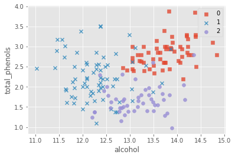
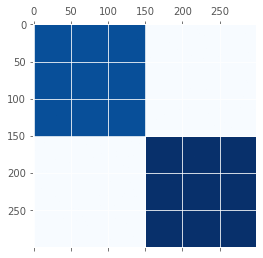
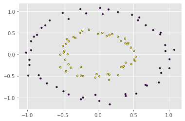

# Task01 熟悉机器学习的三大主要任务

## 1 知识梳理

## 1.1 机器学习概念

- 机器学习概念：利用数学模型来理解数据，发现数据中的规律，用于数据的分析和预测

## 1.2 机器学习任务分类

- 有监督学习：给定特征进行估计因变量，预测结果
    - 回归：因变量是连续变量
    - 分类：因变量是离散变量
- 无监督学习：给定特征，但不给定因变量，寻找数据中的结构和关系

# 2 实战练习


```python
# 引入相关科学计算包
import numpy as np
import pandas as pd
import matplotlib.pyplot as plt
%matplotlib inline 
plt.style.use("ggplot")      
import seaborn as sns
```

## 2.1 回归


```python
from sklearn import datasets
# sklearn内置数据集：糖尿病数据集
diabetes = datasets.load_diabetes() 
# 返回一个类似于字典的类
X = diabetes.data
y = diabetes.target
features = diabetes.feature_names
diabetes_data = pd.DataFrame(X,columns=features)
diabetes_data['disease_progression'] = y
diabetes_data.head()
```


<div>
<style scoped>
    .dataframe tbody tr th:only-of-type {
        vertical-align: middle;
    }

    .dataframe tbody tr th {
        vertical-align: top;
    }

    .dataframe thead th {
        text-align: right;
    }
</style>
<table border="0" class="dataframe">
  <thead>
    <tr style="text-align: right;">
      <th></th>
      <th>age</th>
      <th>sex</th>
      <th>bmi</th>
      <th>bp</th>
      <th>s1</th>
      <th>s2</th>
      <th>s3</th>
      <th>s4</th>
      <th>s5</th>
      <th>s6</th>
      <th>disease_progression</th>
    </tr>
  </thead>
  <tbody>
    <tr>
      <th>0</th>
      <td>0.038076</td>
      <td>0.050680</td>
      <td>0.061696</td>
      <td>0.021872</td>
      <td>-0.044223</td>
      <td>-0.034821</td>
      <td>-0.043401</td>
      <td>-0.002592</td>
      <td>0.019908</td>
      <td>-0.017646</td>
      <td>151.0</td>
    </tr>
    <tr>
      <th>1</th>
      <td>-0.001882</td>
      <td>-0.044642</td>
      <td>-0.051474</td>
      <td>-0.026328</td>
      <td>-0.008449</td>
      <td>-0.019163</td>
      <td>0.074412</td>
      <td>-0.039493</td>
      <td>-0.068330</td>
      <td>-0.092204</td>
      <td>75.0</td>
    </tr>
    <tr>
      <th>2</th>
      <td>0.085299</td>
      <td>0.050680</td>
      <td>0.044451</td>
      <td>-0.005671</td>
      <td>-0.045599</td>
      <td>-0.034194</td>
      <td>-0.032356</td>
      <td>-0.002592</td>
      <td>0.002864</td>
      <td>-0.025930</td>
      <td>141.0</td>
    </tr>
    <tr>
      <th>3</th>
      <td>-0.089063</td>
      <td>-0.044642</td>
      <td>-0.011595</td>
      <td>-0.036656</td>
      <td>0.012191</td>
      <td>0.024991</td>
      <td>-0.036038</td>
      <td>0.034309</td>
      <td>0.022692</td>
      <td>-0.009362</td>
      <td>206.0</td>
    </tr>
    <tr>
      <th>4</th>
      <td>0.005383</td>
      <td>-0.044642</td>
      <td>-0.036385</td>
      <td>0.021872</td>
      <td>0.003935</td>
      <td>0.015596</td>
      <td>0.008142</td>
      <td>-0.002592</td>
      <td>-0.031991</td>
      <td>-0.046641</td>
      <td>135.0</td>
    </tr>
  </tbody>
</table>
</div>


```python
sns.scatterplot(x=diabetes_data['s4'],
                y=diabetes_data['disease_progression'],
                color="r",alpha=0.6)
plt.title("s4~bp")
plt.show()
```


    

    


各个特征的相关解释：
- age：年龄
- sex：性别
- bmi：体重指标
- bp：平均血压
- s1、s2、s3、s4、s5、s6：六次血清测量值
- disease_progression：一年疾病进展的测量值

## 2.2 分类


```python
from sklearn import datasets
# sklearn内置数据集：葡萄酒识别数据集
wine = datasets.load_wine()
X = wine.data
y = wine.target
features = wine.feature_names
wine_data = pd.DataFrame(X,columns=features)
wine_data['target'] = y
wine_data.head()
```


<div>
<style scoped>
    .dataframe tbody tr th:only-of-type {
        vertical-align: middle;
    }

    .dataframe tbody tr th {
        vertical-align: top;
    }

    .dataframe thead th {
        text-align: right;
    }
</style>
<table border="0" class="dataframe">
  <thead>
    <tr style="text-align: right;">
      <th></th>
      <th>alcohol</th>
      <th>malic_acid</th>
      <th>ash</th>
      <th>alcalinity_of_ash</th>
      <th>magnesium</th>
      <th>total_phenols</th>
      <th>flavanoids</th>
      <th>nonflavanoid_phenols</th>
      <th>proanthocyanins</th>
      <th>color_intensity</th>
      <th>hue</th>
      <th>od280/od315_of_diluted_wines</th>
      <th>proline</th>
      <th>target</th>
    </tr>
  </thead>
  <tbody>
    <tr>
      <th>0</th>
      <td>14.23</td>
      <td>1.71</td>
      <td>2.43</td>
      <td>15.6</td>
      <td>127.0</td>
      <td>2.80</td>
      <td>3.06</td>
      <td>0.28</td>
      <td>2.29</td>
      <td>5.64</td>
      <td>1.04</td>
      <td>3.92</td>
      <td>1065.0</td>
      <td>0</td>
    </tr>
    <tr>
      <th>1</th>
      <td>13.20</td>
      <td>1.78</td>
      <td>2.14</td>
      <td>11.2</td>
      <td>100.0</td>
      <td>2.65</td>
      <td>2.76</td>
      <td>0.26</td>
      <td>1.28</td>
      <td>4.38</td>
      <td>1.05</td>
      <td>3.40</td>
      <td>1050.0</td>
      <td>0</td>
    </tr>
    <tr>
      <th>2</th>
      <td>13.16</td>
      <td>2.36</td>
      <td>2.67</td>
      <td>18.6</td>
      <td>101.0</td>
      <td>2.80</td>
      <td>3.24</td>
      <td>0.30</td>
      <td>2.81</td>
      <td>5.68</td>
      <td>1.03</td>
      <td>3.17</td>
      <td>1185.0</td>
      <td>0</td>
    </tr>
    <tr>
      <th>3</th>
      <td>14.37</td>
      <td>1.95</td>
      <td>2.50</td>
      <td>16.8</td>
      <td>113.0</td>
      <td>3.85</td>
      <td>3.49</td>
      <td>0.24</td>
      <td>2.18</td>
      <td>7.80</td>
      <td>0.86</td>
      <td>3.45</td>
      <td>1480.0</td>
      <td>0</td>
    </tr>
    <tr>
      <th>4</th>
      <td>13.24</td>
      <td>2.59</td>
      <td>2.87</td>
      <td>21.0</td>
      <td>118.0</td>
      <td>2.80</td>
      <td>2.69</td>
      <td>0.39</td>
      <td>1.82</td>
      <td>4.32</td>
      <td>1.04</td>
      <td>2.93</td>
      <td>735.0</td>
      <td>0</td>
    </tr>
  </tbody>
</table>
</div>


```python
# 可视化特征
marker = ['s','x','o']
for index,c in enumerate(np.unique(y)):
    plt.scatter(x=wine_data.loc[y==c,"alcohol"],y=wine_data.loc[y==c,"total_phenols"],alpha=0.8,label=c,marker=marker[c])
plt.xlabel("alcohol")
plt.ylabel("total_phenols")
plt.legend()
plt.show()
```


    

    


各个特征的相关解释：
   - alcohol：酒精
   - malic_acid：苹果酸
   - ash：灰
   - alcalinity_of_ash：灰的碱度
   - magnesium：镁
   - total_phenols：总酚
   - flavanoids：类黄酮
   - nonflavanoid_phenols：非类黄酮酚
   - proanthocyanins：原花青素
   - color_intensity：色彩强度
   - hue：色调
   - od280/od315_of_diluted_wines：稀释酒的OD280 / OD315
   - proline：脯氨酸

## 2.3 无监督学习


```python
from sklearn import datasets
```


```python
# 生成具有恒定块对角线结构的数据
data, rows, columns = datasets.make_biclusters(shape=(300, 300), 
                                n_clusters=2, shuffle=False, 
                                noise=0.05, random_state=None)
plt.matshow(data, cmap=plt.cm.Blues);
```


    

    


```python
# 生产包含较小圆圈的大圆圈数据集
X, y = datasets.make_circles(factor=0.5, random_state=0, noise=0.05)
plt.scatter(X[:, 0], X[:, 1], c=y, s=12, edgecolor='k');
```


    

    

