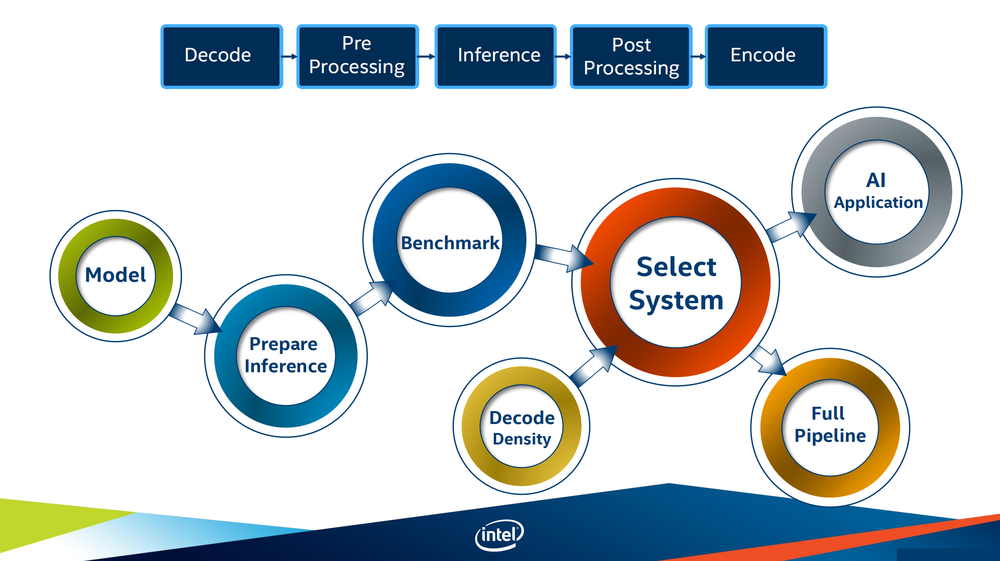

# Task02 了解OpenVINO工具套件如何应用在AI领域

## 1 OpenVINO的示例演示

- 交互式人脸检测：netron查看模型，通过一个摄像头获取人脸，使用脸部检测模型，年龄和性别检测模型、头部检测模型、表情检测模型、特征检测模型等
- 多通道人脸检测：通过视频流进行人脸检测
- 重新识别和跟踪：人员检测模型，绘制每个人的跟踪路线
- 道路分割：将每辆汽车进行分割，并显示标签

## 2 如何使用英特尔OpenVINO工具实现从数据采集到AI产品诞生（上）

### 2.1 构建AI应用流程

- 描述开发人员从选择正确模型到构成系统的整个阶段
- 系统选择（Select System）：选择合适的系统后，产品可以轻松的扩展，并能够在任何银行或超市环境中安装使用，可在一个系统中部署不同的设备，比如CPU、GPU、FPGA和AI加速器）
  1. CPU：OpenVINO代码是可以移植的，针对CPU编程，之后可以轻松将程序移植到其他设备，支持ATOM、CORE、XEON等系列
  2. GPU：渲染3D图形、加速推理和视频处理（编解码），支持IRIS、Discreate Graphics等系列
  3. FPGA：支持Arria10 HDDL-F
  4. AI加速器：支持MOVIDIUS、NERVANA等智能硬件，提升8~10倍加速
- 寻找模型（Model）：基于深度学习的模型执行分割、检测、分类任务等
- 准备推理（Perpare Inference）：模型通常在云环境训练，可能在较小的设备上运行，模型通常采用浮点格式，可能需要转换数据格式
- 性能指标评测（Benchmark）：用于了解模型性能，比如每秒可以执行的推理次数，可以使用多种优化技术和多种数据格式，最终选择满足性能要求的平台
- 解码能力（Decode Density）：应支持尽可能多的摄像头或者视频流，从而降低每个摄像头的成本
- 完整流程（Full Pipeline）：了解从推理、性能指标评测、编解码能力的多个流程
- AI应用（AI Application）：将分析处理流程和推理整合到现有的应用中

### 2.2 总结

- OpenVINO提供了构建AI应用的所有工具：获取一个深度学习模型，对视频分析流程中的所有指标进行性能评测，最后构建一个AI应用
- Intel有多种平台可供选择，包括CPU、集成GPU、基于Movidius的VPU和FPGA
- OpenVINO支持异构系统

## 3 如何使用英特尔OpenVINO工具实现从数据采集到AI产品诞生（下）

### 3.1 获取模型（Model）

- 模型下载器（Model Downloader）
- 训练（Train）模型：收集数据（Collect）、清洗数据（Prepare）、图像标注（Annotate，可以使用计算机视觉标注工具）、训练（Training）
- Model Zoo：预训练模型（Pre-Trained models），训练扩展（Training extensions）支持基于自定义数据或提供的检查点进行模型训练

### 3.2 准备推理（Perpare Inference）

- 模型优化器（Model Optimizer）：将多种类型的模型（Model）转换为IR格式的模型，将其映射到正确的库函数或内核（Map），可以使用水平或垂直融合、归一化、规范化各种技术优化模型（Optimize），支持添加或删除一个或多个神经网络层（Customize），最终得到一个优化过的精简模型

### 3.3 性能指标评测（Benchmark）

- 提供指标评测器（Benchmark App），可显示延迟、吞吐量等信息
- Dev Cloud：类似于大型的沙盒，支持所有Intel芯片，提供所有的软件，远程连接设备，对工作负载进行性能测试
- 性能计算器（Performance Counters）：OpenVINO已内置，可以运行网络，查找每一层的统计数据
- WorkBench：提供直观的图形界面，支持性能测试的展示

### 3.4 解码能力（Decode Density）

- 提供监控集成显卡利用率的工具
- 提供快速入门示例

### 3.5 完整流程（Full Pipeline）

- OpenVINO GStreamer Video Analystics（GVA）插件：包括OpenVINO Inference Elements和GStreamer Elements，用于构建视频处理流程的平台，提供分类、检测、识别、跟踪和可视化等流程

### 3.6 AI应用（AI Application）

- 提供40个C++/Python演示示例
- 提供高级操作，例如多路视频分析、跟踪对象
- 提供简短代码片段，可以直接放入应用中

### 3.7 总结

- OpenVINO是一款用于构建视频分析流程的综合分析套件
- 可以在整个流程中使用相应的工具、程序和资源：获得深度学习模型、针对推理准备模型、执行性能指标评测、查看编解码能力、模拟完整的软件产品流程、构建AI应用

## 4 课程回顾

- 第1节课：介绍了AI将改变我们生活的方方面面，视觉应用将带来机遇和商业潜力
- 第2节课：视频是互联网最常见的传输数据类型，讨论了像素，并了解大量的像素构建了图片，大量的图片构成了视频；可通过过滤图像、模糊、锐化、边缘检测的特征提取等操作，介绍了使用OpenCV能加速视觉计算处理
- 第3节课：介绍了视频压缩、冗余及视频压缩的工作原理，使用Intel集成显卡加速压缩，通过Media-SDK使用Intel快速视频同步技术加速视频处理
- 第4节课：介绍了人工智能算法、面向视觉应用的神经网络，并讨论了实时执行神经网络的复杂性，主要介绍了使用模拟化优化器和推理引擎加速视频推理
- 第5节课：介绍了视频分析流程，构建AI应用的所需步骤和落地要求，并介绍了OpenVINO的整体架构
- 第6节课：提供了DEMO演示，主要展示了交互式人脸检测、多路人脸检测、重新识别和跟踪、道路分割等示例
- 第7节课：介绍了Intel提供的异构平台，并介绍了各种硬件产品，包括CPU、GPU、FPGA和AI加速器等，学习OpenVINO构建完整AI应用流程
- 第8节课：详细讲解了整个流程，并介绍了可供开发人员使用的工具、程序和资源

## 5 总结

&emsp;&emsp;本次任务，主要介绍了OpenVINO工具套件在AI领域的应用：
1. 演示交互式人脸检测、多路人脸检测、重新识别和跟踪、道路分割等示例
2. 介绍构建AI应用的完整流程，以及用到的所有工具
3. 回顾了整个8节课的所有内容
