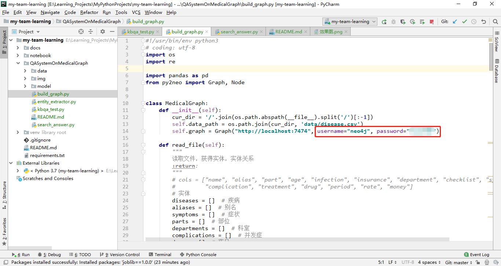
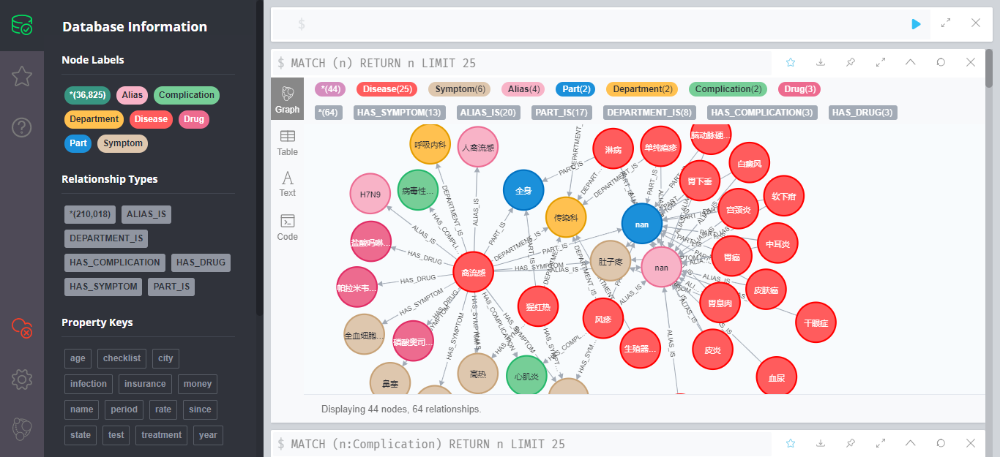
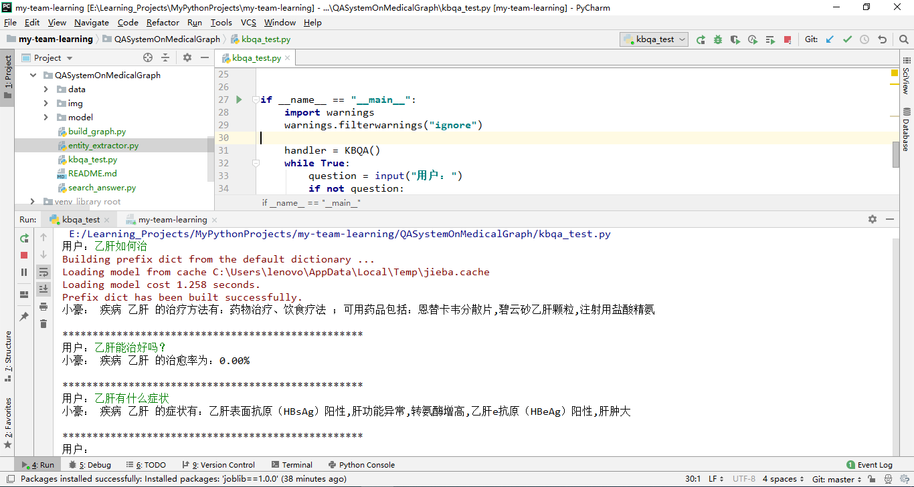

# Task 2 基于医疗知识图谱的问答系统操作介绍

## 1 基于医疗知识图谱的问答系统

&emsp;&emsp;该项目（https://github.com/zhihao-chen/QASystemOnMedicalGraph ） 是基于医疗领域知识图谱的问答系统，采用KBQA（基于知识库的问答）模式构建，通过手工标记210条意图分类训练数据，并采用朴素贝叶斯算法训练得到意图分类模型。

## 2 搭建知识图谱

&emsp;&emsp;预先修改`build_group.py`文件中关于`Neo4j`的用户名和密码，并执行完成图数据库的数据初始化。

访问`Neo4j`的可视化界面，可以看到如下的数据关系图

## 3 启动问答测试
需要安装`pyahocorasick`库，并安装`scikit-learn`的0.22版本  
运行程序`kbqa_test.py`，运行结果如下：

## 4 FAQ

1. 安装`pyahocorasick`库时，需要安装`VC++14.0`，可下载`vs_buildtools`

2. 将代码改成`import joblib`还是会调用`sklearn.externals.joblib`，一直没有好的解决方案，只能将sklearn版本降至0.22版本（当前最新版本0.24版）
