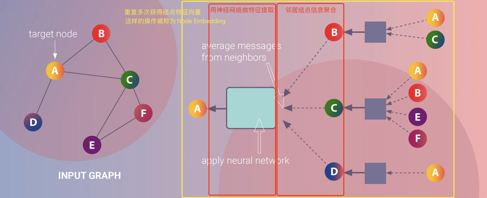

# 消息传递图神经网络

## 一、引言

在开篇中我们已经介绍，为节点生成节点表征是图计算任务成功的关键，我们要采用图神经网络实现节点表征学习。在此小节，我们将学习**基于神经网络的生成节点表征的范式——消息传递范式**。**消息传递范式是一种聚合邻接节点信息来更新中心节点信息的范式**，它将卷积算子推广到了不规则数据领域，实现了图与神经网络的连接。**此范式包含三个步骤：(1)邻接节点信息变换、(2)邻接节点信息聚合到中心节点、(3)聚合信息变换**。因其简单且强大的特性，它广泛地被人们所采用。此外，我们还将学习**如何基于消息传递范式构建图神经网络**。

## 二、 消息传递范式介绍

用$\mathbf{x}^{(k-1)}_i\in\mathbb{R}^F$表示$(k-1)$层中节点$i$的节点特征，$\mathbf{e}_{j,i} \in \mathbb{R}^D$ 表示从节点$j$到节点$i$的边的特征，消息传递图神经网络可以描述为
$$
\mathbf{x}_i^{(k)} = \gamma^{(k)} \left( \mathbf{x}_i^{(k-1)}, \square_{j \in \mathcal{N}(i)} \, \phi^{(k)}\left(\mathbf{x}_i^{(k-1)}, \mathbf{x}_j^{(k-1)},\mathbf{e}_{j,i}\right) \right),
$$
其中$\square$表示可微分的、具有排列不变性（函数输出结果与输入参数的排列无关）的函数。具有排列不变性的函数有，和函数、均值函数和最大值函数。$\gamma$和$\phi$表示可微分的函数，如MLPs（多层感知器）。此处内容来源于[CREATING MESSAGE PASSING NETWORKS](https://pytorch-geometric.readthedocs.io/en/latest/notes/create_gnn.html#creating-message-passing-networks)。

神经网络的生成节点表征的操作可称为节点嵌入（Node Embedding），节点表征也可以称为节点嵌入。**为了统一此次组队学习中的表述**，我们**规定节点嵌入只代指神经网络生成节点表征的操作**。

下方图片展示了**基于消息传递范式的生成节点表征的过程**：

1. 在图的最右侧，B节点的邻接节点（A,C）的信息传递给了B，经过信息变换得到了B的嵌入，C、D节点同。
2. 在图的中右侧，A节点的邻接节点（B,C,D）的之前得到的节点嵌入传递给了节点A；在图的中左侧，聚合得到的信息经过信息变换得到了A节点新的嵌入。
3. 重复多次，我们可以得到每一个节点的经过多次信息变换的嵌入。这样的经过多次信息聚合与变换的节点嵌入就可以作为节点的表征，可以用于节点的分类。



## 三、Pytorch Geometric中的`MessagePassing`基类

Pytorch Geometric(PyG)提供了[`MessagePassing`](https://pytorch-geometric.readthedocs.io/en/latest/modules/nn.html#torch_geometric.nn.conv.message_passing.MessagePassing)基类，它实现了消息传播的自动处理，继承该基类可使我们方便地构造消息传递图神经网络，我们**只需定义函数$\phi$**，即[`message()`](https://pytorch-geometric.readthedocs.io/en/latest/modules/nn.html#torch_geometric.nn.conv.message_passing.MessagePassing.message)函数，和**函数$\gamma$**，即[`update()`](https://pytorch-geometric.readthedocs.io/en/latest/modules/nn.html#torch_geometric.nn.conv.message_passing.MessagePassing.update)函数，以及使用的**消息聚合方案**，即`aggr="add"`、`aggr="mean"`或`aggr="max"`。这些是在以下方法的帮助下完成的：	

- `MessagePassing(aggr="add", flow="source_to_target", node_dim=-2)`： 
  - `aggr`：定义要使用的聚合方案（"add"、"mean "或 "max"）；
  - `flow`：定义消息传递的流向（"source_to_target "或 "target_to_source"）；
  - `node_dim`：定义沿着哪个轴线传播。
- `MessagePassing.propagate(edge_index, size=None, **kwargs)`：
  - 开始传播消息的起始调用。它以`edge_index`（边的端点的索引）和`flow`（消息的流向）以及一些额外的数据为参数。
  - 请注意，`propagate()`不仅限于在形状为`[N, N]`的对称邻接矩阵中交换消息，还可以通过传递`size=(N, M)`作为额外参数。例如，在二部图的形状为`[N, M]`的一般稀疏分配矩阵中交换消息。
  - 如果设置`size=None`，则假定邻接矩阵是对称的。
  - 对于有两个独立的节点集合和索引集合的二部图，并且每个集合都持有自己的信息，我们可以传递一个元组参数，即`x=(x_N, x_M)`，来标记信息的区分。
- `MessagePassing.message(...)`：
  - 首先确定要给节点$i$传递消息的边的集合，如果`flow="source_to_target"`，则是$(j,i) \in \mathcal{E}$的边的集合；
  - 如果`flow="target_to_source"`，则是$(i,j) \in \mathcal{E}$的边的集合。
  - 接着为各条边创建要传递给节点$i$的消息，即实现$\phi$函数。
  - `MessagePassing.message(...)`函数接受最初传递给`MessagePassing.propagate(edge_index, size=None, **kwargs)`函数的所有参数。
  - 此外，传递给`propagate()`的张量可以被映射到各自的节点$i$和$j$上，只需在变量名后面加上`_i`或`_j`。我们把$i$称为消息传递的目标中心节点，把$j$称为邻接节点。
- `MessagePassing.aggregate(...)`：
  - 将从源节点传递过来的消息聚合在目标节点上，一般可选的聚合方式有`sum`, `mean`和`max`。
- `MessagePassing.message_and_aggregate(...)`：
  - 在一些场景里，邻接节点信息变换和邻接节点信息聚合这两项操作可以融合在一起，那么我们可以在此函数里定义这两项操作，从而让程序运行更加高效。
- `MessagePassing.update(aggr_out, ...)`: 
  - 为每个节点$i \in \mathcal{V}$更新节点表征，即实现$\gamma$函数。该函数以聚合函数的输出为第一个参数，并接收所有传递给`propagate()`函数的参数。

以上内容来源于[The “MessagePassing” Base Class](https://pytorch-geometric.readthedocs.io/en/latest/notes/create_gnn.html#the-messagepassing-base-class)。

## 四、继承`MessagePassing`类的`GCNConv`

**GCNConv的数学定义为**
$$
\mathbf{x}_i^{(k)} = \sum_{j \in \mathcal{N}(i) \cup \{ i \}} \frac{1}{\sqrt{\deg(i)} \cdot \sqrt{\deg(j)}} \cdot \left( \mathbf{\Theta} \cdot \mathbf{x}_j^{(k-1)} \right),
$$
其中，相邻节点的特征首先通过权重矩阵$\mathbf{\Theta}$进行转换，然后按端点的度进行归一化处理，最后进行加总。这个公式可以分为以下几个步骤：

1. 向邻接矩阵添加自环边。
1. 线性转换节点特征矩阵。
1. 计算归一化系数。
1. 归一化$j$中的节点特征。
1. 将相邻节点特征相加（"求和 "聚合）。

步骤1-3通常是在消息传递发生之前计算的。步骤4-5可以使用[`MessagePassing`](https://pytorch-geometric.readthedocs.io/en/latest/modules/nn.html#torch_geometric.nn.conv.message_passing.MessagePassing)基类轻松处理。该层的全部实现如下所示。

```python
import torch
from torch_geometric.nn import MessagePassing
from torch_geometric.utils import add_self_loops, degree

class GCNConv(MessagePassing):
    def __init__(self, in_channels, out_channels):
        super(GCNConv, self).__init__(aggr='add', flow='source_to_target')
        # "Add" aggregation (Step 5).
        # flow='source_to_target' 表示消息从源节点传播到目标节点
        self.lin = torch.nn.Linear(in_channels, out_channels)

    def forward(self, x, edge_index):
        # x has shape [N, in_channels]
        # edge_index has shape [2, E]

        # Step 1: Add self-loops to the adjacency matrix.
        edge_index, _ = add_self_loops(edge_index, num_nodes=x.size(0))

        # Step 2: Linearly transform node feature matrix.
        x = self.lin(x)

        # Step 3: Compute normalization.
        row, col = edge_index
        deg = degree(col, x.size(0), dtype=x.dtype)
        deg_inv_sqrt = deg.pow(-0.5)
        norm = deg_inv_sqrt[row] * deg_inv_sqrt[col]

        # Step 4-5: Start propagating messages.
        return self.propagate(edge_index, x=x, norm=norm)

    def message(self, x_j, norm):
        # x_j has shape [E, out_channels]
        # Step 4: Normalize node features.
        return norm.view(-1, 1) * x_j

```

[`GCNConv`](https://pytorch-geometric.readthedocs.io/en/latest/modules/nn.html#torch_geometric.nn.conv.GCNConv)继承了`MessagePassing`并以"求和"作为领域节点信息聚合方式。该层的所有逻辑都发生在其`forward()`方法中。在这里，我们首先使用`torch_geometric.utils.add_self_loops()`函数向我们的边索引添加自循环边（步骤1），以及通过调用`torch.nn.Linear`实例对节点特征进行线性变换（步骤2）。

归一化系数是由每个节点的节点度得出的，它被转换为每个边的节点度。结果被保存在形状`[num_edges,]`的张量`norm`中（步骤3）。

在[`message()`](https://pytorch-geometric.readthedocs.io/en/latest/modules/nn.html#torch_geometric.nn.conv.message_passing.MessagePassing.message)函数中，我们需要通过`norm`对相邻节点特征`x_j`进行归一化处理。这里，`x_j`包含每条边的源节点特征，即每个中心节点的邻接。

这就是创建一个简单的x传递层的全部内容。我们可以把这个层作为深度架构的构建块。我们可以很方便地初始化和调用它：

```python
conv = GCNConv(16, 32)
x = conv(x, edge_index)
```

以上内容来源于[Implementing the GCN Layer](https://pytorch-geometric.readthedocs.io/en/latest/notes/create_gnn.html#implementing-the-gcn-layer)。

## 五、`propagate`函数

`propagate`函数源码：

```python
def propagate(self, edge_index: Adj, size: Size = None, **kwargs):
    r"""开始消息传播的初始调用。
    Args:
        edge_index (Tensor or SparseTensor): 定义了消息传播流。
        	当flow="source_to_target"时，节点`edge_index[0]`的信息将被发送到节点`edge_index[1]`，
        	反之当flow="target_to_source"时，节点`edge_index[1]`的信息将被发送到节点`edge_index[0]`
        kwargs: 图其他属性或额外的数据。
    """
```

`edge_index`是`propagate`函数必须的参数。在我们的`message`函数中希望接受到哪些数据（或图的属性或额外的数据），就要在`propagate`函数的调用中传递哪些参数。

## 六、覆写`message`函数

在第四部分例子中，我们覆写的`message`函数接收两个参数`x_j`和`norm`，而`propagate`函数被传递三个参数`edge_index, x=x, norm=norm`。由于`x`是`Data`类的属性，且`message`函数接收`x_j`参数而不是`x`参数，所以在`propagate`函数被调用，`message`函数被执行之前，一项额外的操作被执行，该项操作根据`edge_index`参数从`x`中分离出`x_j`。事实上，在`message`函数里，当参数是`Data`类的属性时，我们可以在参数名后面拼接`_i`或`_j`来指定要接收源节点的属性或是目标节点的属性。类似的，如果我们希望在`message`函数中额外再接受源节点的度，那么我们做如下的修改（假设节点的度为`deg`，它是`Data`对象的属性）：

```python
class GCNConv(MessagePassing):
    def forward(self, x, edge_index):
        # ....
        return self.propagate(edge_index, x=x, norm=norm, d=d)
    def message(self, x_j, norm, d_i):
        # x_j has shape [E, out_channels]
        return norm.view(-1, 1) * x_j * d_i # 这里不管正确性
        
```

## 七、覆写`aggregate`函数

我们在前面的例子中增加如下的`aggregate`函数，通过观察运行结果我们发现，我们覆写的`aggregate`函数被调用，同时在`super(GCNConv, self).__init__(aggr='add')`中传递给`aggr`参数的值被存储到了`self.aggr`属性中。

```python
class GCNConv(MessagePassing):
    def __init__(self, in_channels, out_channels):
        super(GCNConv, self).__init__(aggr='add', flow='source_to_target')
        
    def forward(self, x, edge_index):
        # ....
        return self.propagate(edge_index, x=x, norm=norm, d=d)

    def aggregate(self, inputs, index, ptr, dim_size):
        print(self.aggr)
        print("`aggregate` is called")
        return super().aggregate(inputs, index, ptr=ptr, dim_size=dim_size)
        
```

## 八、覆写`message_and_aggregate`函数

在一些例子中，消息传递与消息聚合可以融合在一起，这种情况我们通过覆写`message_and_aggregate`函数来实现：

```python
from torch_sparse import SparseTensor

class GCNConv(MessagePassing):
    def __init__(self, in_channels, out_channels):
        super(GCNConv, self).__init__(aggr='add', flow='source_to_target')
        
    def forward(self, x, edge_index):
        # ....
        adjmat = SparseTensor(row=edge_index[0], col=edge_index[1], value=torch.ones(edge_index.shape[1]))
        # 此处传的不再是edge_idex，而是SparseTensor类型的Adjancency Matrix
        return self.propagate(adjmat, x=x, norm=norm, d=d)
    
    def message(self, x_j, norm, d_i):
        # x_j has shape [E, out_channels]
        return norm.view(-1, 1) * x_j * d_i # 这里不管正确性
    
    def aggregate(self, inputs, index, ptr, dim_size):
        print(self.aggr)
        print("`aggregate` is called")
        return super().aggregate(inputs, index, ptr=ptr, dim_size=dim_size)
    
    def message_and_aggregate(self, adj_t, x, norm):
        print('`message_and_aggregate` is called')

```

运行程序后我们可以看到虽然我们同时覆写了`message`函数和`aggregate`函数，然而只有`message_and_aggregate`函数被执行。

## 九、覆写`update`函数

```python
class GCNConv(MessagePassing):
    def __init__(self, in_channels, out_channels):
        super(GCNConv, self).__init__(aggr='add', flow='source_to_target')

    def update(self, inputs: Tensor) -> Tensor:
        return inputs

```

`update`函数接收聚合的输出作为第一个参数，并接收传递给`propagate`的任何参数。

## 十、结语

消息传递范式是实现图神经网络的一种通用范式。消息传递范式遵循“消息传播->消息聚合->消息更新”这一过程，实现将邻接节点的信息聚合到中心节点上。在PyG中，`MessagePassing`是所有基于消息传递范式的图神经网络的基类。`MessagePassing`类大大方便了我们图神经网络的构建，但由于其高度封装性，它也向我们隐藏了很多的细节。

通过此篇文章的学习，我们打开了`MessagePassing`类的黑箱子，介绍了继承`MessagePassing`类构造自己的图神经网络类的规范。我们再次强调，要掌握如何基于`MessagePassing`类构建自己的图神经网络类，我们不能仅停留于理论理解层面，我们需要通过逐行代码调试，来观察代码运行流程。

## 作业

1. 请总结`MessagePassing`类的运行流程以及继承`MessagePassing`类的规范。
2. 请继承`MessagePassing`类来自定义以下的图神经网络类，并进行测试：
   1. 第一个类，覆写`message`函数，要求该函数接收消息传递源节点属性`x`、目标节点度`d`。
   2. 第二个类，在第一个类的基础上，再覆写`aggregate`函数，要求不能调用`super`类的`aggregate`函数，并且不能直接复制`super`类的`aggregate`函数内容。
   3. 第三个类，在第二个类的基础上，再覆写`update`函数，要求对节点信息做一层线性变换。
   4. 第四个类，在第三个类的基础上，再覆写`message_and_aggregate`函数，要求在这一个函数中实现前面`message`函数和`aggregate`函数的功能。

## 参考资料

- [CREATING MESSAGE PASSING NETWORKS](https://pytorch-geometric.readthedocs.io/en/latest/notes/create_gnn.html#creating-message-passing-networks)
- [torch_geometric.nn.conv.message_passing.MessagePassing](https://pytorch-geometric.readthedocs.io/en/latest/modules/nn.html#torch_geometric.nn.conv.message_passing.MessagePassing)
- [The “MessagePassing” Base Class](https://pytorch-geometric.readthedocs.io/en/latest/notes/create_gnn.html#the-messagepassing-base-class)
- [Implementing the GCN Layer](https://pytorch-geometric.readthedocs.io/en/latest/notes/create_gnn.html#implementing-the-gcn-layer)

